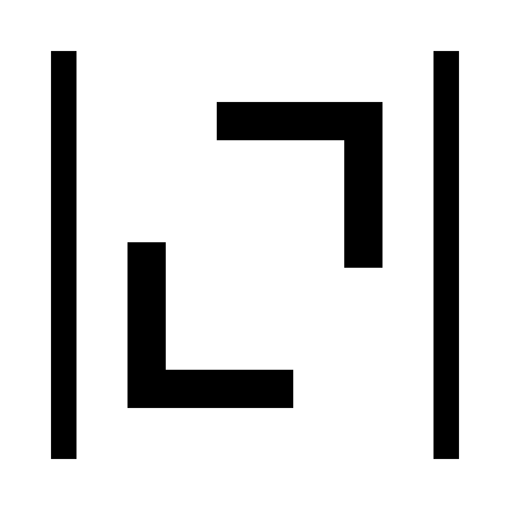

#  &nbsp; Numerone

The Number One Octave-like Programming Language Written in Rust

<picture style="display: flex; justify-content: center; padding: 2em; height: 5em;">
    <source media="(prefers-color-scheme: dark)" srcset="assets/brainmade-white.svg">
    <source media="(prefers-color-scheme: light)" srcset="assets/brainmade-black.svg">
    
</picture>

This is NOT intented for prouduction use,
this is just simple project for me to learn the Rust prgramming language.

Feel free to NOT submit an issue nor a pull request,
as i am trying to learn at my own pace and share what i have done to the world without any interruption.

In other words, this is a playground for me.

Cheers 🍒
